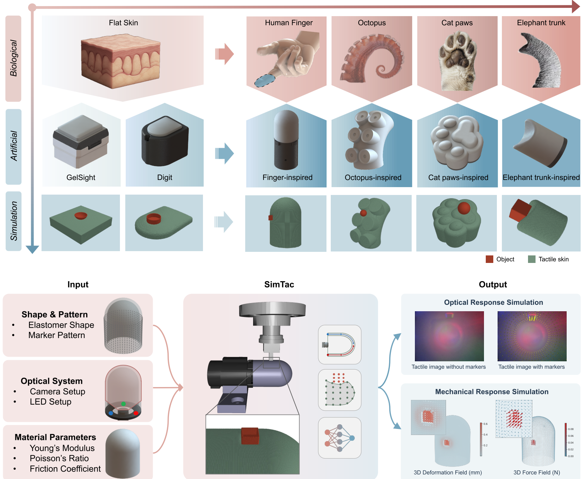

# SimTac: Simulating Vision-Based Tactile Sensors with Biomorphic Structures

This repository provides the code implementation for the paper:

**Simulating Vision-Based Tactile Sensors with Biomorphic Structures**

In this work, we present SimTac, a physics-based simulator for vision-based tactile sensors with biomorphic geometries, capable of generating accurate optical and mechanical responses in real time. SimTac features three core components: a particle-based framework for simulating sensor deformation, a light field rendering system for generating high-fidelity tactile images, and a neural network for predicting dense force distributions. The simulator offers exceptional flexibility, supporting a broad range of biomorphic shapes—including human fingers, cat paws, octopus tentacles, and elephant trunks—as well as diverse optical configurations and material properties, from soft elastomers to rigid substrates. SimTac also enables zero-shot sim-to-real transfer across a variety of tactile perception tasks, such as object shape classification, slip detection, and contact safety assessment. 

<p align="center">
    
</p>

> Dataset can be downloaded from [Dataset]()

## Installation
### Step 1: Build the environment
```python
conda create --name SimTac python=3.8.18
conda activate SimTac
pip install torch==1.10.0+cu111 torchvision==0.11.0+cu111 torchaudio==0.10.0 -f https://download.pytorch.org/whl/torch_stable.html
conda env update --name SimTac --file environment_final.yml
```
### Step 2: Install MinkowskiEngine
```
pip install torch ninja
sudo apt install build-essential python3-dev libopenblas-dev
sudo apt install g++-7
git clone https://github.com/NVIDIA/MinkowskiEngine.git
cd MinkowskiEngine
python setup.py install --blas_include_dirs=${CONDA_PREFIX}/include --blas=openblas
```

## Quick Start
### 1. Simulation of a human-finger-shaped GelTip sensor 
- For simulation of contact with *indenters*,
```
cd SimTac
python SimTac_GelTip_indenter.py
```
- For simulation of contact with *textures*,
```
cd SimTac
python SimTac_GelTip_texture.py
```
- For simulation of contact with *YCB objects*,
```
cd SimTac
python SimTac_GelTip_YCB.py
```

### 2. Simulation of other biomorphic-shaped tactile sensors
- For *cat-paws-shaped sensor*,
```
cd Experiments/01_Biomimetic_sensor_simulation/Cat_paws_shaped
python SimTac_CAT_PAWS.py
```
- For *octopus-tentacle-shaped sensor*,
```
cd Experiments/01_Biomimetic_sensor_simulation/Octopus
python SimTac_Octopus.py
```
- For *elephant-truck-shaped sensor*,
```
cd Experiments/01_Biomimetic_sensor_simulation/Elephant_truck_shaped
python SimTac_Elephant_Truck.py
```
- For *human-thumb-shaped sensor*,
```
cd Experiments/01_Biomimetic_sensor_simulation/Thumb_shaped
python SimTac_THUMB.py```
- For *DigiTac sensor*,
```
cd Experiments/01_Biomimetic_sensor_simulation/DigiTac
python SimTac_DIGITAC.py
```
- For *GelSignt sensor*,
```
cd Experiments/01_Biomimetic_sensor_simulation/GelSight
python SimTac_Gelsight.py
```
### 3. Sim2Real task 1 - contact object classification
- For *model training*,
```
cd Experiments/02_Classification
python 01_train_classifier.py 
```
- For *model testingtest*,
```
cd Experiments/02_Classification
python 02_test_classifier.py 
```

### 4. Sim2Real task 2 - slip detection
- For *model training*,
```
cd Experiments/03_Slip_Detection
python 01_train_net.py 
```

- For *model testing*,
```
cd Experiments/03_Slip_Detection
python 02_test_net.py 
```

### 5. Sim2Real task 3 - contact safety assessment
- For *model training*,
```
cd Experiments/04_Contact_Safety_Assessment
python 01_train_regressor.py 
```

- For *model testing*,
```
cd Experiments/04_Contact_Safety_Assessment
python 02_test_regressor.py 
```

### 6. Force Prediction Model
- For *model training*,
```
cd Experiments/05_STN_Training_and_Fine_tuning
python Train_Displacement.py 
python Train_Force.py 
```

- For *model testing*,
```
cd Experiments/05_STN_Training_and_Fine_tuning 
python Test_Displacement.py
python Test_Force.py 
```

## Citation

## Contact

Any questions, feel free to reach out to:

Xuyang Zhang: *xuyang.zhang@kcl.ac.uk*

